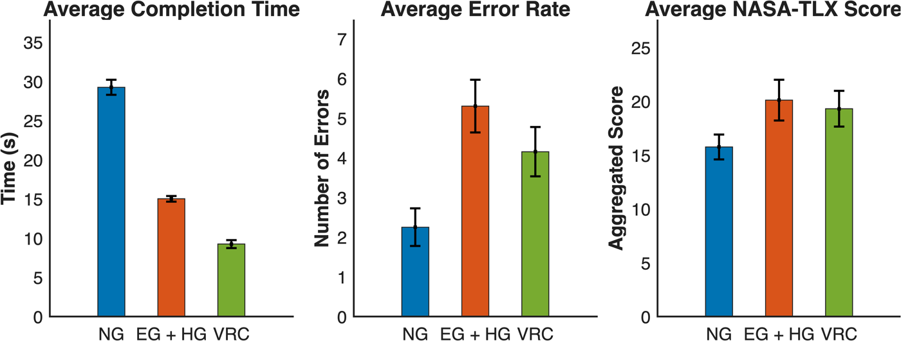
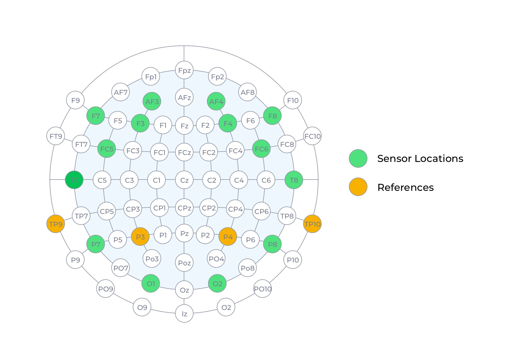
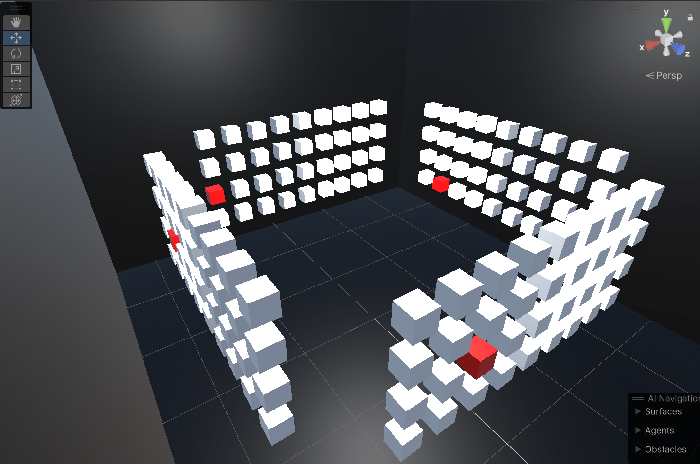
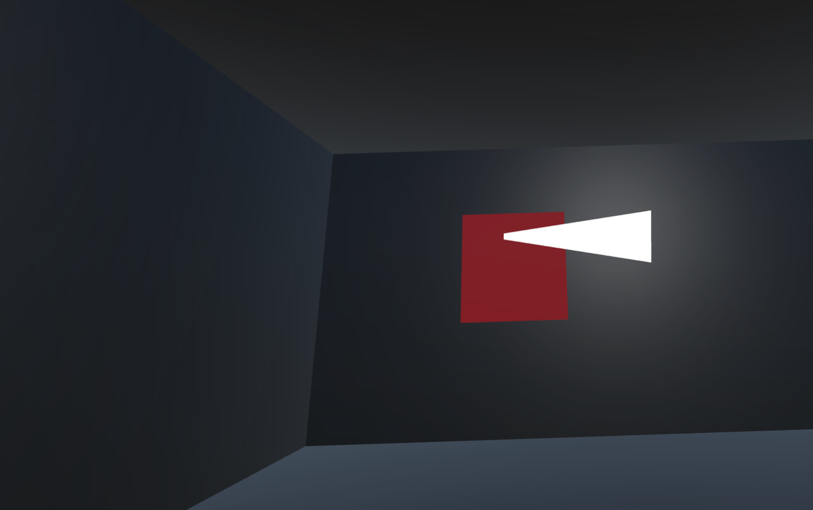

# NeuroGaze

**A hybrid EEG and eye-tracking brain–computer interface for hands-free interaction in virtual reality**

[](https://www.frontiersin.org/journals/human-neuroscience/articles/10.3389/fnhum.2025.1695446/full)
[](https://doi.org/10.3389/fnhum.2025.1695446)
[](https://unity.com/)
[](LICENSE)
[](https://creativecommons.org/licenses/by/4.0/)

<p align="center">
  
</p>

This repository is the official code, data, and study-materials release for:

> Coutray K, Barbel W, Groth Z and LaViola JJ Jr (2025). *NeuroGaze: a hybrid EEG and eye-tracking brain-computer interface for hands-free interaction in virtual reality.* **Frontiers in Human Neuroscience** 19:1695446. doi: [10.3389/fnhum.2025.1695446](https://doi.org/10.3389/fnhum.2025.1695446)

---

## Overview

VR input methods force a trade-off between speed, accuracy, and physical effort. Controllers are fast but fatiguing; gaze-plus-pinch is ergonomic but depends on reliable hand mobility. **NeuroGaze** removes the hands entirely: the user *aims* with eye gaze and *confirms* with an EEG-classified "pull" mental command.

The system is built entirely from off-the-shelf consumer hardware — a **Meta Quest Pro** (eye tracking) worn together with an **Emotiv EPOC X** (14-channel EEG) — rather than laboratory-grade equipment, so the results speak to whether hybrid BCIs are usable outside the lab.

Twenty participants completed a 360° cube-selection task under three input conditions:

| Condition | Aim | Confirm |
|---|---|---|
| **VRC** — VR Controllers | Controller ray | Trigger press |
| **EG+HG** — Eye Gaze + Hand Gesture | Eye-gaze ray | Pinch (optical hand tracking) |
| **NG** — NeuroGaze | Eye-gaze ray | EEG "pull" mental command |

This is a **feasibility study**, not a throughput benchmark: the three conditions have intrinsically different confirmation latencies, so completion times reflect cumulative latency rather than normalized throughput.

---

## Key results

<p align="center">
  
</p>

| Measure | NeuroGaze (NG) | Eye Gaze + Hand Gesture | VR Controllers | Test |
|---|---|---|---|---|
| Completion time (s) | 29.23 ± 4.33 | 15.02 ± 1.61 | **9.25 ± 2.26** | *F*(2,38) = 275.4, *p* < .001, η²ₚ = .935 |
| Errors per block | **2.25 ± 2.12** | 5.30 ± 2.98 | 4.15 ± 2.78 | *F*(2,38) = 6.27, *p* = .004, η²ₚ = .25 |
| NASA-TLX (aggregated) | **15.75** | 20.10 | 19.30 | Friedman χ²(2) = 0.29, *n.s.* |
| Physical demand | **2.4** | 3.8 | 3.85 | NG < EG+HG, *p* = .006 |
| Temporal demand | **2.4** | 3.6 | 4.35 | NG < both, *p* = .002 / .001 |
| Ranked most preferred | **10 / 20** | 5 / 20 | 5 / 20 | χ²(2, *N* = 20) = 4.8, *p* = .31 |

Bold marks the best value per row. Pairwise comparisons are Bonferroni-corrected (α = .0157 for NASA-TLX sub-scales).

**What this shows.** NeuroGaze produced significantly *fewer errors* than gaze+pinch and significantly *lower physical and temporal demand*, but was roughly **3× slower** than controllers — a classic speed–accuracy trade-off. The accuracy advantage stems largely from participants' more deliberate pacing under EEG confirmation latency rather than from superior input fidelity. NeuroGaze is best positioned as a *complementary* modality for accessibility, rehabilitation, and fatigue-sensitive long-duration use, not as a replacement for controllers in time-critical tasks.

---

## Method at a glance

### Apparatus

| Component | Detail |
|---|---|
| HMD | Meta Quest Pro, integrated binocular eye tracking @ 72 Hz, 5-point calibration per session |
| EEG | Emotiv EPOC X, 14 active electrodes (AF3, F7, F3, FC5, T7, P7, O1, O2, P8, T8, FC6, F4, F8, AF4), mastoid references (TP9, P3, P4, TP10) |
| Sampling | 2,048 Hz internally, downsampled to 128 Hz for BLE transmission |
| Engine | Unity 2023.2.11f1 + Meta XR All-in-One SDK |
| EEG bridge | Emotiv Cortex API via the Emotiv Unity plugin; EmotivBCI handles profiles, noise sanitization, and classification |

<p align="center">
  
</p>

### Task

<p align="center">
  
</p>

Four walls each hold a 4 × 9 array of white cubes (36 per wall, **144 total**), roughly 2 m from the participant. At the start of each block, **12 cubes turn red** (three per wall); the block ends when all targets are cleared, requiring participants to rotate through the full 360° field. Each condition is run for **3 blocks**, giving **9 blocks per participant**.

Gaze casts a white ray forward from the midpoint of the two eye anchors. Hovered cubes scale up to 0.2304 m³ and shrink back to 0.18 m³ on hover exit, providing the aiming feedback shared by all three conditions.

### EEG calibration

<p align="center">
  
</p>

Two mental-command classes are trained before evaluation:

1. **Neutral** — relaxed, unfocused brain activity.
2. **Pull** — the selection command.

Each is trained over **20 repetitions**, with accepted trials saved to the participant's Emotiv profile. During calibration the target cube shrinks in synchrony with the participant's imagined action; this feedback was delivered via a **Wizard-of-Oz** procedure (the administrator manually triggered the shrink) to reinforce consistent neural patterns. The evaluation task itself ran on the genuinely trained classifier. This is noted as a limitation in the paper — it may have inflated participants' perception of system reliability during calibration.

---

## Repository structure

```
NeuroGaze/
├── unity/                              # Unity 2023.2.11f1 project (main application)
│   ├── Assets/
│   │   ├── Scenes/
│   │   │   ├── Training Scene.unity     # EEG neutral/pull calibration
│   │   │   ├── Evaluation Scene.unity   # 360° cube-selection task
│   │   │   └── Old Scenes/              # Per-condition scenes used to run the study
│   │   ├── Scripts/                     # Gaze ray, interactables, per-condition managers
│   │   │   └── Code Cleanup/            # Post-publication refactor (see note below)
│   │   ├── Assessment_Results/          # Raw + processed per-participant logs
│   │   └── unity-plugin-master/         # Emotiv Unity plugin (Cortex API bridge, MIT)
│   └── ProjectSettings/
├── Data Analysis/                      # MATLAB live script + figure/CSV exports
├── Research Documents/                 # IRB protocol & approval, consent form, NASA-TLX,
│                                       #   recruitment materials, thesis, figures
├── Eye Tracking Demo/                  # Minimal standalone eye-tracking sandbox
└── readme-assets/
```

### Scripts

| Script | Role |
|---|---|
| `EyeTrackingRay.cs` | Casts the gaze ray from the eye midpoint and reports hover state |
| `ControllerTrackingRay.cs` | Equivalent ray for the VR-controller condition |
| `EyeInteractable*.cs` | Per-cube hover scaling, target state, and selection handling |
| `EyeInteractableManager*.cs` | Block orchestration, target assignment, and result logging (one variant per condition) |
| `CubeTrainingManager.cs` | Drives the calibration stimulus during EEG training |
| `AssessmentManager*.cs` | Writes per-participant CSV logs |

The `*ForHands` and `*ForControllers` suffixes correspond to the **EG+HG** and **VRC** conditions; the unsuffixed files are the **NeuroGaze** path.

> **Note on `Scripts/Code Cleanup/`.** These files (`EmotivService`, `TrainingOrchestrator`, `EvaluationOrchestrator`, `CubeTrainingStimulus`) are a post-publication refactor that consolidates Emotiv connection handling and automates the training loop. They are **not** wired into any scene and were **not** used to produce the published results. The scenes under `Old Scenes/` are what the study was run with.

---

## Requirements

**Hardware**

- Meta Quest Pro (eye tracking is required; other Quest headsets lack it)
- Emotiv EPOC X, plus saline solution and a comfort headband to keep both devices seated together
- A Windows PC for Quest Link / Air Link and the Emotiv Cortex service

**Software**

- Unity **2023.2.11f1**
- Meta XR All-in-One SDK `com.meta.xr.sdk.all` 85.0.0 (installed via the package manager)
- [Emotiv Launcher / Cortex service](https://www.emotiv.com/pages/cortex) with an Emotiv account and an **application Client ID / Secret**
- EmotivBCI for training-profile management

---

## Getting started

1. **Clone and open.**

   ```bash
   git clone https://github.com/Wanyea/NeuroGaze.git
   ```

   Open the `unity/` folder in Unity 2023.2.11f1 and let packages resolve.

2. **Enable eye and hand tracking.** In the headset, enable eye tracking and hand tracking and complete eye-tracking calibration. The Quest Pro will prompt for permission the first time the app requests gaze data.

3. **Start the Emotiv stack.** Launch the Emotiv Launcher, connect and moisten the EPOC X, and confirm all 14 electrodes report good contact quality before proceeding.

4. **Supply Emotiv credentials.** Create an application at [emotiv.com](https://www.emotiv.com/) to obtain a Client ID and Secret, then set them on the Emotiv service component in the scene. Credentials are **not** committed to this repository — do not ship them in a client build.

5. **Train the classifier.** Open `Training Scene.unity` and run the neutral and pull blocks (20 repetitions each). Save the profile between blocks.

6. **Run the evaluation.** Open `Evaluation Scene.unity` (or the matching per-condition scene under `Old Scenes/`) and run the 360° selection task. Each `AssessmentManager` writes a per-run CSV to `unity/Assets/Assessment Results/<Condition>/`; the study's collected logs are archived in `unity/Assets/Assessment_Results/` (underscored).

> Electrode contact quality dominates classifier reliability. Re-apply saline whenever contact degrades — this was the single most common source of trouble during data collection.

---

## Data and analysis

| Path | Contents |
|---|---|
| `unity/Assets/Assessment_Results/<Condition>/` | Per-participant, per-block CSV logs from the Unity task |
| `unity/Assets/Assessment_Results/Complete_NASA_TLX/` | Raw and processed NASA-TLX responses |
| `Data Analysis/bar_charts.mlx` | MATLAB live script generating the figures below |
| `Data Analysis/sorted_avg_task_completion_time.csv` | Per-participant mean completion time by condition |
| `Data Analysis/gross_error_rate.csv` | Per-participant error counts by condition |
| `Data Analysis/NASA_TLX.csv` | Per-participant aggregated NASA-TLX scores |

Columns are labelled `EG_HG` / `NG` / `VRC` corresponding to the three conditions. Figures are exported as TIFF (publication) and PDF.

**Statistical approach.** Completion time and error rate were analysed with repeated-measures ANOVA (Mauchly's test for sphericity; Greenhouse–Geisser correction where violated) followed by Bonferroni-corrected pairwise *t*-tests with 95% CIs and effect sizes. NASA-TLX aggregates used a Friedman test, sub-scales used Wilcoxon signed-rank tests with Bonferroni correction (α = .0157). Preference rankings used a chi-squared test of independence.

---

## Limitations

Summarised from the paper, for anyone building on this work:

- **N = 20**, all healthy young adults (18–32), ~75% with prior VR experience — the population least likely to benefit from hands-free input.
- Static targets on fixed walls; no moving or context-sensitive stimuli.
- The Wizard-of-Oz calibration feedback may have inflated perceived reliability during training.
- Consumer-grade EEG SNR restricted the system to a **binary** command scheme with conservative activation thresholds.
- Confirmation latencies differ intrinsically across conditions, so timings are not normalized throughput. No ITR or Fitts'-law measures were collected.
- Wearing the EPOC X and Quest Pro simultaneously caused minor discomfort over extended use.

---

## Ethics

The study was approved by the University of Central Florida Institutional Review Board (**IRB ID: STUDY00006401**). All participants provided written informed consent. The IRB protocol, approval letter, and consent form are included under `Research Documents/`.

---

## Citation

```bibtex
@article{coutray2025neurogaze,
  title   = {NeuroGaze: a hybrid {EEG} and eye-tracking brain-computer interface
             for hands-free interaction in virtual reality},
  author  = {Coutray, Kyle and Barbel, Wanyea and Groth, Zack and LaViola Jr., Joseph J.},
  journal = {Frontiers in Human Neuroscience},
  volume  = {19},
  pages   = {1695446},
  year    = {2025},
  doi     = {10.3389/fnhum.2025.1695446},
  url     = {https://www.frontiersin.org/journals/human-neuroscience/articles/10.3389/fnhum.2025.1695446/full}
}
```

---

## Authors

Wanyea Barbel, Kyle Coutray, Zack Groth, and Joseph J. LaViola Jr.
Interactive Systems and User Experience Research Cluster, Department of Computer Science, University of Central Florida.

Correspondence: Wanyea Barbel — wanyeabarbel@gmail.com

---

## Acknowledgments and license

Portions of this research were previously included in the Master's thesis of Wanyea Barbel, archived in the UCF STARS Digital Repository (Barbel, 2024); the published article is a reformatted and condensed version of that work.

The code in this repository is released under the [MIT License](LICENSE). The article and its figures are published under [CC BY 4.0](https://creativecommons.org/licenses/by/4.0/) — reuse them with attribution to the citation above. The bundled Emotiv Unity plugin (`unity/Assets/unity-plugin-master/`) is distributed by EMOTIV under its own MIT License. The Meta XR SDK is subject to Meta's license terms.
